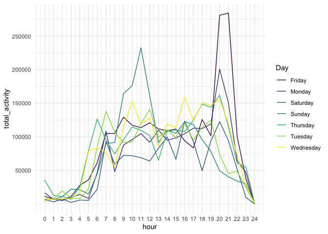

p8105\_hw3\_mk4208
================
Meeraj Kothari
10/10/2019

``` r
library(tidyverse)
```

    ## ── Attaching packages ─────────────────────────────────────── tidyverse 1.2.1 ──

    ## ✔ ggplot2 3.2.1     ✔ purrr   0.3.2
    ## ✔ tibble  2.1.3     ✔ dplyr   0.8.3
    ## ✔ tidyr   1.0.0     ✔ stringr 1.4.0
    ## ✔ readr   1.3.1     ✔ forcats 0.4.0

    ## ── Conflicts ────────────────────────────────────────── tidyverse_conflicts() ──
    ## ✖ dplyr::filter() masks stats::filter()
    ## ✖ dplyr::lag()    masks stats::lag()

``` r
library(p8105.datasets)
library(viridis)
```

    ## Loading required package: viridisLite

Problem 1

Loading the Instacart dataset

``` r
data("instacart") 
```

# Here is a short description of the dataset:

  - There are **1384617 observations** and **15 variables**.
  - It contains the following variables: **order\_id, product\_id,
    add\_to\_cart\_order, reordered, user\_id, eval\_set, order\_number,
    order\_dow, order\_hour\_of\_day, days\_since\_prior\_order,
    product\_name, aisle\_id, department\_id, aisle, department**.

-----

There are **134** aisles. The following table shows the aisles from
which most number of items were ordered

``` r
instacart %>% 
  group_by(aisle, aisle_id) %>% 
  summarise(n = n()) %>% 
  arrange(desc(n)) %>% 
  head() %>%
  knitr::kable()
```

| aisle                         | aisle\_id |      n |
| :---------------------------- | --------: | -----: |
| fresh vegetables              |        83 | 150609 |
| fresh fruits                  |        24 | 150473 |
| packaged vegetables fruits    |       123 |  78493 |
| yogurt                        |       120 |  55240 |
| packaged cheese               |        21 |  41699 |
| water seltzer sparkling water |       115 |  36617 |

The following plot shows the number of items ordered in each aisle
limited to aisles with more than 10000 items ordered

``` r
instacart %>% 
  group_by(aisle) %>% 
  summarise(n = n()) %>% 
  filter(n > 10000) %>% 
  arrange(desc(n)) %>% 
  ggplot(aes(x = reorder(aisle, n), y = n)) +
  geom_point(alpha = 0.5) + 
  scale_y_continuous(
    breaks = seq(0, 160000, 10000),
    labels = function(x) format(x, big.mark = ",", scientific = FALSE)
    ) +
  coord_flip() + 
  theme(axis.text.x = element_text(angle = 45, hjust = 1)) +
  theme_minimal()
```

<!-- -->

The following table shows the three most popular items in each of the
aisles: “baking ingredients”, “dog food care” and “packaged vegetable
fruits” including the number of times each item is ordered

``` r
instacart %>% 
  filter(aisle %in% c("baking ingredients", "dog food care", "packaged vegetables fruits")) %>% 
  group_by(aisle, product_name) %>% 
  summarize(n = n()) %>%
  mutate(product_rank = min_rank(desc(n))) %>% 
  filter(product_rank <= 3 ) %>%
  arrange(aisle, product_rank)
```

    ## # A tibble: 9 x 4
    ## # Groups:   aisle [3]
    ##   aisle               product_name                           n product_rank
    ##   <chr>               <chr>                              <int>        <int>
    ## 1 baking ingredients  Light Brown Sugar                    499            1
    ## 2 baking ingredients  Pure Baking Soda                     387            2
    ## 3 baking ingredients  Cane Sugar                           336            3
    ## 4 dog food care       Snack Sticks Chicken & Rice Recip…    30            1
    ## 5 dog food care       Organix Chicken & Brown Rice Reci…    28            2
    ## 6 dog food care       Small Dog Biscuits                    26            3
    ## 7 packaged vegetable… Organic Baby Spinach                9784            1
    ## 8 packaged vegetable… Organic Raspberries                 5546            2
    ## 9 packaged vegetable… Organic Blueberries                 4966            3

The following table shows the mean hour of the day at which Pink Lady
Apples and Coffee Ice Cream are ordered on each day of the week

``` r
instacart %>% 
  filter(product_name %in% c("Pink Lady Apples", "Coffee Ice Cream")) %>% 
  group_by(product_name, order_dow) %>% 
  summarize(
    mean = mean(order_hour_of_day)
  ) %>% 
  pivot_wider(
    names_from = order_dow,
    values_from = mean
  )
```

    ## # A tibble: 2 x 8
    ## # Groups:   product_name [2]
    ##   product_name       `0`   `1`   `2`   `3`   `4`   `5`   `6`
    ##   <chr>            <dbl> <dbl> <dbl> <dbl> <dbl> <dbl> <dbl>
    ## 1 Coffee Ice Cream  13.8  14.3  15.4  15.3  15.2  12.3  13.8
    ## 2 Pink Lady Apples  13.4  11.4  11.7  14.2  11.6  12.8  11.9

Problem 2

Loading the BRFSS dataset

``` r
data("brfss_smart2010")
```

In the following code chunk, the dataset is formatted to use appropriate
variable names. The dataset is filtered to focus on the “Overall Health”
topic and includes responses only from “Excelled” to “Poor”. The
responses are organized as a factor taking levels ordered from “Poor” to
“Excellent”

``` r
brfss = brfss_smart2010 %>% 
  janitor::clean_names() %>% 
  filter(topic %in% "Overall Health") %>% 
  mutate(
    response = ordered(response, c("Poor", "Fair", "Good", "Very good", "Excellent"))
  )
```

The following table shows the states that were observed at 7 or more
locations in 2002

``` r
brfss %>% 
  filter(year %in% 2002) %>% 
  group_by(locationabbr) %>% 
  summarise(num = n_distinct(locationdesc)) %>% 
  filter(num >= 7)
```

    ## # A tibble: 6 x 2
    ##   locationabbr   num
    ##   <chr>        <int>
    ## 1 CT               7
    ## 2 FL               7
    ## 3 MA               8
    ## 4 NC               7
    ## 5 NJ               8
    ## 6 PA              10

The following table shows the states that were observed at 7 or more
locations in 2010

``` r
brfss %>% 
  filter(year %in% 2010) %>% 
  group_by(locationabbr) %>% 
  summarise(num = n_distinct(locationdesc)) %>% 
  filter(num >= 7)
```

    ## # A tibble: 14 x 2
    ##    locationabbr   num
    ##    <chr>        <int>
    ##  1 CA              12
    ##  2 CO               7
    ##  3 FL              41
    ##  4 MA               9
    ##  5 MD              12
    ##  6 NC              12
    ##  7 NE              10
    ##  8 NJ              19
    ##  9 NY               9
    ## 10 OH               8
    ## 11 PA               7
    ## 12 SC               7
    ## 13 TX              16
    ## 14 WA              10

The following code chunk contructs a dataset limited to `Excellent`
responses, and contains `year`, `state` and a variable `meanvar` that
averages the `data_value` across locations within a state.

``` r
excellent_data = brfss %>% 
  filter(response %in% "Excellent") %>%
  group_by(year, locationabbr) %>% 
  summarise(meanvar = mean(data_value)) 
  
head(excellent_data)
```

    ## # A tibble: 6 x 3
    ## # Groups:   year [1]
    ##    year locationabbr meanvar
    ##   <int> <chr>          <dbl>
    ## 1  2002 AK              27.9
    ## 2  2002 AL              18.5
    ## 3  2002 AR              24.1
    ## 4  2002 AZ              24.1
    ## 5  2002 CA              22.7
    ## 6  2002 CO              23.1

The following code chunk creates a “spaghetti” plot of `meanvar`
(average value) over time within a state.

``` r
excellent_data %>% 
   ggplot(aes(x = year, y = meanvar, group = locationabbr, color = locationabbr)) + 
   geom_line() +  
  viridis::scale_color_viridis(
    name = "State", 
    discrete = TRUE, 
    option = "viridis"
  ) + 
  theme_minimal()
```

<!-- -->

``` r
brfss %>% 
  filter(locationabbr %in% "NY", 
         year %in% c("2006", "2010")) %>% 
  ggplot(aes(x = response, y = data_value, color = response)) +
  geom_violin(alpha = 0.5) + 
  geom_point() + 
  facet_grid(~ year) + 
  theme_minimal() 
```

<!-- -->

Problem 3

``` r
accel = read_csv("Data/accel_data.csv") %>% 
  janitor::clean_names() %>% 
  pivot_longer(
    activity_1:activity_1440,
    names_to = "minute", 
    names_prefix = "activity_",
    values_to = "activity") %>% 
  mutate(day_type = if_else(
  day %in% c("Saturday", "Sunday"),"weekend", "weekday"),
  day_type = as.factor(day_type),
  minute = as.numeric(minute),
  activity = as.numeric(activity), 
  minute = as.numeric(minute),
  day = as.factor(day), 
  week = as.factor(week),
  day_id = as.numeric(day_id))
```

    ## Parsed with column specification:
    ## cols(
    ##   .default = col_double(),
    ##   day = col_character()
    ## )

    ## See spec(...) for full column specifications.

``` r
head(accel)
```

    ## # A tibble: 6 x 6
    ##   week  day_id day    minute activity day_type
    ##   <fct>  <dbl> <fct>   <dbl>    <dbl> <fct>   
    ## 1 1          1 Friday      1     88.4 weekday 
    ## 2 1          1 Friday      2     82.2 weekday 
    ## 3 1          1 Friday      3     64.4 weekday 
    ## 4 1          1 Friday      4     70.0 weekday 
    ## 5 1          1 Friday      5     75.0 weekday 
    ## 6 1          1 Friday      6     66.3 weekday

``` r
accel %>% 
  group_by(week, day) %>% 
  summarise(
    total_activity = sum(activity)
  ) 
```

    ## # A tibble: 35 x 3
    ## # Groups:   week [5]
    ##    week  day       total_activity
    ##    <fct> <fct>              <dbl>
    ##  1 1     Friday           480543.
    ##  2 1     Monday            78828.
    ##  3 1     Saturday         376254 
    ##  4 1     Sunday           631105 
    ##  5 1     Thursday         355924.
    ##  6 1     Tuesday          307094.
    ##  7 1     Wednesday        340115.
    ##  8 2     Friday           568839 
    ##  9 2     Monday           295431 
    ## 10 2     Saturday         607175 
    ## # … with 25 more rows

``` r
accel %>% 
  mutate(hour = minute %/% 60) %>%
  group_by(day, hour) %>%
  summarise(
    total_activity = sum(activity)
  ) %>%
  ggplot(aes(x = hour, y = total_activity, color = day)) + 
    geom_line() + 
    theme(legend.position = "bottom") + 
  scale_x_continuous(breaks = c(0:24)) +
  scale_y_continuous(
    breaks = c(50000, 100000, 150000, 200000, 250000)
  ) + 
  theme_minimal() + 
  viridis::scale_color_viridis(
    name = "Day", 
    discrete = TRUE, 
    option = "viridis"
  )
```

<!-- -->
