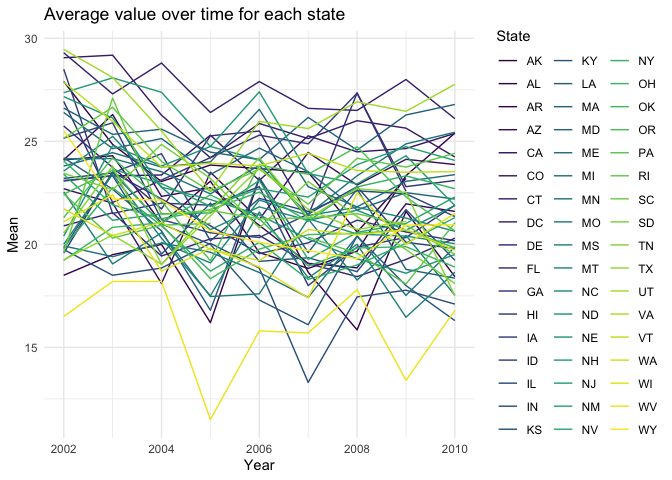
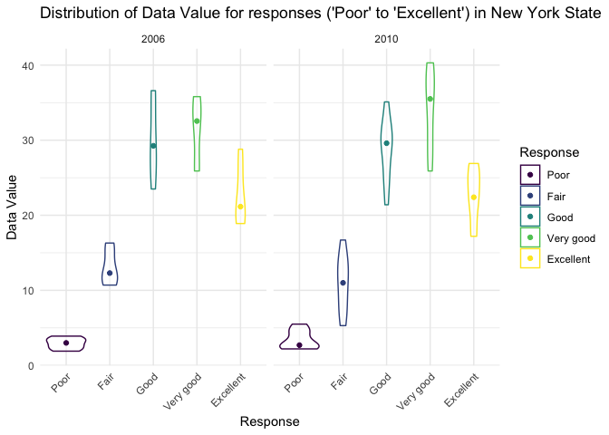

p8105\_hw3\_mk4208
================
Meeraj Kothari
10/10/2019

Loading required packages

``` r
library(tidyverse)
library(p8105.datasets)
library(viridis)
```

# Problem 1

Loading the Instacart dataset

``` r
data("instacart") 
```

### Here is a short description of the dataset:

“The Instacart Online Grocery Shopping Dataset 2017” is an anonymized
dataset with over 3 million online grocery orders from more than 200,000
Instacart users.

  - There are **1384617 observations** and **15 variables**.
  - It contains the following variables
      - `order_id`: order identifier
      - `product_id`: product identifier
      - `add_to_cart_order`: order in which each product was added to
        cart
      - `reordered`: 1 if this prodcut has been ordered by this user in
        the past, 0 otherwise
      - `user_id`: customer identifier
      - `eval_set`: which evaluation set this order belongs in (Note
        that the data for use in this class is exclusively from the
        “train” eval\_set)
      - `order_number`: the order sequence number for this user
        (1=first, n=nth)
      - `order_dow`: the day of the week on which the order was placed
      - `order_hour_of_day`: the hour of the day on which the order was
        placed
      - `days_since_prior_order`: days since the last order, capped at
        30, NA if order\_number=1
      - `product_name`: name of the product
      - `aisle_id`: aisle identifier
      - `department_id`: department identifier
      - `aisle`: the name of the aisle
      - `department`: the name of the department
  - The first observation shows that User with User ID: **112108**
    ordered **Bulgarian Yogurt** with the product ID: **49302** from the
    **yogurt** aisle of the **dairy eggs** department.
  - The second observation shows that User with User ID: **112108**
    ordered **Organic 4% Milk Fat Whole Milk Cottage Cheese** with the
    product ID: **11109** from the **other creams cheeses** aisle of the
    **dairy eggs** department.

-----

There are **134** aisles. The following table shows the aisles from
which most number of items were ordered:

``` r
instacart %>% 
  group_by(aisle, aisle_id) %>% 
  summarise(n = n()) %>% 
  arrange(desc(n)) %>% 
  head(15) %>%
  knitr::kable(col.names = c("Aisle", "Aisle ID", "Number of Items"))
```

| Aisle                         | Aisle ID | Number of Items |
| :---------------------------- | -------: | --------------: |
| fresh vegetables              |       83 |          150609 |
| fresh fruits                  |       24 |          150473 |
| packaged vegetables fruits    |      123 |           78493 |
| yogurt                        |      120 |           55240 |
| packaged cheese               |       21 |           41699 |
| water seltzer sparkling water |      115 |           36617 |
| milk                          |       84 |           32644 |
| chips pretzels                |      107 |           31269 |
| soy lactosefree               |       91 |           26240 |
| bread                         |      112 |           23635 |
| refrigerated                  |       31 |           23228 |
| ice cream ice                 |       37 |           22676 |
| frozen produce                |      116 |           22453 |
| eggs                          |       86 |           19875 |
| crackers                      |       78 |           19592 |

-----

The following plot shows the number of items ordered in each aisle
limited to aisles with more than 10000 items ordered

``` r
instacart %>% 
  group_by(aisle) %>% 
  summarise(n = n()) %>% 
  filter(n > 10000) %>% 
  arrange(desc(n)) %>% 
  ggplot(aes(x = reorder(aisle, n), y = n)) +
  geom_point(aes(color = n)) + 
  scale_color_viridis_c(direction = -1) +
  scale_y_continuous(
    breaks = seq(0, 160000, 10000),
    labels = function(x) format(x, big.mark = ",", scientific = FALSE)
    ) +
  coord_flip() + 
  theme_minimal() + 
  ggtitle("Number of items ordered in each aisle\nwith more than 10,000 items ordered") + 
  theme(legend.position = "none",
        plot.title = element_text(hjust = 0.5),
        axis.text.x = element_text(angle = 45, hjust = 1)) +
  labs(
    y = "Number of items", 
    x = "Aisle Name"
  ) 
```

<!-- -->

-----

The following table shows the three most popular items in each of the
aisles: “baking ingredients”, “dog food care” and “packaged vegetable
fruits” including the number of times each item is ordered

``` r
instacart %>% 
  filter(aisle %in% c("baking ingredients", "dog food care", "packaged vegetables fruits")) %>% 
  group_by(aisle, product_name) %>% 
  summarize(n = n()) %>%
  mutate(product_rank = min_rank(desc(n))) %>% 
  filter(product_rank <= 3 ) %>%
  arrange(aisle, product_rank) %>% 
  knitr::kable(col.names = c("Aisle", "Product Name", "Number of Times", "Product Rank"))
```

| Aisle                      | Product Name                                  | Number of Times | Product Rank |
| :------------------------- | :-------------------------------------------- | --------------: | -----------: |
| baking ingredients         | Light Brown Sugar                             |             499 |            1 |
| baking ingredients         | Pure Baking Soda                              |             387 |            2 |
| baking ingredients         | Cane Sugar                                    |             336 |            3 |
| dog food care              | Snack Sticks Chicken & Rice Recipe Dog Treats |              30 |            1 |
| dog food care              | Organix Chicken & Brown Rice Recipe           |              28 |            2 |
| dog food care              | Small Dog Biscuits                            |              26 |            3 |
| packaged vegetables fruits | Organic Baby Spinach                          |            9784 |            1 |
| packaged vegetables fruits | Organic Raspberries                           |            5546 |            2 |
| packaged vegetables fruits | Organic Blueberries                           |            4966 |            3 |

-----

The following table shows the mean hour of the day at which Pink Lady
Apples and Coffee Ice Cream are ordered on each day of the week

``` r
instacart %>% 
  filter(product_name %in% c("Pink Lady Apples", "Coffee Ice Cream")) %>% 
  group_by(product_name, order_dow) %>%
  summarize(
    mean = mean(order_hour_of_day)
  ) %>% 
  pivot_wider(
    names_from = order_dow,
    values_from = mean
  ) %>% 
  knitr::kable(col.names = c("Product Name", "Day 0", "Day 1", "Day 2", "Day 3", "Day 4", "Day 5", "Day 6"))
```

| Product Name     |    Day 0 |    Day 1 |    Day 2 |    Day 3 |    Day 4 |    Day 5 |    Day 6 |
| :--------------- | -------: | -------: | -------: | -------: | -------: | -------: | -------: |
| Coffee Ice Cream | 13.77419 | 14.31579 | 15.38095 | 15.31818 | 15.21739 | 12.26316 | 13.83333 |
| Pink Lady Apples | 13.44118 | 11.36000 | 11.70213 | 14.25000 | 11.55172 | 12.78431 | 11.93750 |

# Problem 2

Loading the BRFSS dataset

``` r
data("brfss_smart2010")
```

In the following code chunk, the dataset is formatted to use appropriate
variable names. The dataset is filtered to focus on the “Overall Health”
topic and includes responses only from “Excellent” to “Poor”. The
responses are organized as a factor taking levels ordered from “Poor” to
“Excellent”

``` r
brfss = brfss_smart2010 %>% 
  janitor::clean_names() %>% 
  filter(topic %in% "Overall Health") %>% 
  mutate(
    response = ordered(response, c("Poor", "Fair", "Good", "Very good", "Excellent"))
  )

head(brfss)
```

    ## # A tibble: 6 x 23
    ##    year locationabbr locationdesc class topic question response sample_size
    ##   <int> <chr>        <chr>        <chr> <chr> <chr>    <ord>          <int>
    ## 1  2010 AL           AL - Jeffer… Heal… Over… How is … Excelle…          94
    ## 2  2010 AL           AL - Jeffer… Heal… Over… How is … Very go…         148
    ## 3  2010 AL           AL - Jeffer… Heal… Over… How is … Good             208
    ## 4  2010 AL           AL - Jeffer… Heal… Over… How is … Fair             107
    ## 5  2010 AL           AL - Jeffer… Heal… Over… How is … Poor              45
    ## 6  2010 AL           AL - Mobile… Heal… Over… How is … Excelle…          91
    ## # … with 15 more variables: data_value <dbl>, confidence_limit_low <dbl>,
    ## #   confidence_limit_high <dbl>, display_order <int>,
    ## #   data_value_unit <chr>, data_value_type <chr>,
    ## #   data_value_footnote_symbol <chr>, data_value_footnote <chr>,
    ## #   data_source <chr>, class_id <chr>, topic_id <chr>, location_id <chr>,
    ## #   question_id <chr>, respid <chr>, geo_location <chr>

-----

The following table shows the states that were observed at 7 or more
locations in 2002

``` r
brfss %>% 
  filter(year %in% 2002) %>% 
  group_by(locationabbr) %>% 
  summarise(num = n_distinct(locationdesc)) %>% 
  filter(num >= 7) %>% 
  knitr::kable(col.names = c("State", "Locations"))
```

| State | Locations |
| :---- | --------: |
| CT    |         7 |
| FL    |         7 |
| MA    |         8 |
| NC    |         7 |
| NJ    |         8 |
| PA    |        10 |

-----

The following table shows the states that were observed at 7 or more
locations in 2010

``` r
brfss %>% 
  filter(year %in% 2010) %>% 
  group_by(locationabbr) %>% 
  summarise(num = n_distinct(locationdesc)) %>% 
  filter(num >= 7) %>%
  knitr::kable(col.names = c("State", "Locations"))
```

| State | Locations |
| :---- | --------: |
| CA    |        12 |
| CO    |         7 |
| FL    |        41 |
| MA    |         9 |
| MD    |        12 |
| NC    |        12 |
| NE    |        10 |
| NJ    |        19 |
| NY    |         9 |
| OH    |         8 |
| PA    |         7 |
| SC    |         7 |
| TX    |        16 |
| WA    |        10 |

-----

The following code chunk contructs a dataset limited to `Excellent`
responses, and contains `year`, `state` and a variable `meanvar` that
averages the `data_value` across locations within a state.

``` r
excellent_data = brfss %>% 
  filter(response %in% "Excellent") %>%
  group_by(year, locationabbr) %>% 
  summarise(meanvar = mean(data_value)) 
  
head(excellent_data) 
```

    ## # A tibble: 6 x 3
    ## # Groups:   year [1]
    ##    year locationabbr meanvar
    ##   <int> <chr>          <dbl>
    ## 1  2002 AK              27.9
    ## 2  2002 AL              18.5
    ## 3  2002 AR              24.1
    ## 4  2002 AZ              24.1
    ## 5  2002 CA              22.7
    ## 6  2002 CO              23.1

-----

The following code chunk creates a “spaghetti” plot of `meanvar`
(average value) over time within each state.

``` r
excellent_data %>% 
   ggplot(aes(x = year, y = meanvar, group = locationabbr, color = locationabbr)) + 
   geom_line() +  
  viridis::scale_color_viridis(
    name = "State", 
    discrete = TRUE, 
    option = "viridis"
  ) + 
  theme_minimal() +
  labs(
    x = "Year",
    y = "Mean", 
    title = "Average value over time for each state"
  )
```

<!-- -->

-----

The following two-panel plot shows the distribution of `data_value` for
responses (“Poor” to “Excellent”) among locations in NY state

``` r
brfss %>% 
  filter(locationabbr %in% "NY", 
         year %in% c("2006", "2010")) %>%
  ggplot(aes(x = response, y = data_value, color = response)) +
  geom_violin(alpha = 0.5) + 
  stat_summary(fun.y = median, geom = "point") +
  facet_grid(~ year) + 
  labs(
    x = "Response", 
    y = "Data Value", 
    title = "Distribution of Data Value for responses ('Poor' to 'Excellent') in New York State") + 
   viridis::scale_color_viridis(
    name = "Response", 
    discrete = TRUE, 
    option = "viridis"
  ) + 
  theme_minimal() + 
  theme(axis.text.x = element_text(angle = 45, hjust = 1)) 
```

<!-- -->

# Problem 3

Loading and tidying the accelerometer data. A variable `day_type` has
been included to indicate weekend vs weeday.

``` r
accel = read_csv("Data/accel_data.csv") %>% 
  janitor::clean_names() %>% 
  pivot_longer(
    activity_1:activity_1440,
    names_to = "minute", 
    names_prefix = "activity_",
    values_to = "activity") %>% 
  mutate(day_type = if_else(
  day %in% c("Saturday", "Sunday"),"weekend", "weekday"),
  day_type = as.factor(day_type),
  minute = as.numeric(minute),
  activity = as.numeric(activity), 
  minute = as.numeric(minute),
  day = as.factor(day), 
  week = as.factor(week),
  day_id = as.numeric(day_id))

head(accel) 
```

    ## # A tibble: 6 x 6
    ##   week  day_id day    minute activity day_type
    ##   <fct>  <dbl> <fct>   <dbl>    <dbl> <fct>   
    ## 1 1          1 Friday      1     88.4 weekday 
    ## 2 1          1 Friday      2     82.2 weekday 
    ## 3 1          1 Friday      3     64.4 weekday 
    ## 4 1          1 Friday      4     70.0 weekday 
    ## 5 1          1 Friday      5     75.0 weekday 
    ## 6 1          1 Friday      6     66.3 weekday

### Here is a short description of the dataset:

  - There are **50400 observations** and **6 variables**.
  - It contains the following variables: **week, day\_id, day, minute,
    activity, day\_type**.

-----

The following table shows `total_activity` for each day. Based on this
table, it is difficult to detect a trend in the daily activity, however,
we can see that Saturdays of Week 4 and 5 had the least activity

``` r
accel %>% 
  group_by(week, day) %>% 
  summarise(
    total_activity = sum(activity)
  ) %>% 
  knitr::kable(col.names = c("Week", "Day", "Total Activity"))
```

| Week | Day       | Total Activity |
| :--- | :-------- | -------------: |
| 1    | Friday    |      480542.62 |
| 1    | Monday    |       78828.07 |
| 1    | Saturday  |      376254.00 |
| 1    | Sunday    |      631105.00 |
| 1    | Thursday  |      355923.64 |
| 1    | Tuesday   |      307094.24 |
| 1    | Wednesday |      340115.01 |
| 2    | Friday    |      568839.00 |
| 2    | Monday    |      295431.00 |
| 2    | Saturday  |      607175.00 |
| 2    | Sunday    |      422018.00 |
| 2    | Thursday  |      474048.00 |
| 2    | Tuesday   |      423245.00 |
| 2    | Wednesday |      440962.00 |
| 3    | Friday    |      467420.00 |
| 3    | Monday    |      685910.00 |
| 3    | Saturday  |      382928.00 |
| 3    | Sunday    |      467052.00 |
| 3    | Thursday  |      371230.00 |
| 3    | Tuesday   |      381507.00 |
| 3    | Wednesday |      468869.00 |
| 4    | Friday    |      154049.00 |
| 4    | Monday    |      409450.00 |
| 4    | Saturday  |        1440.00 |
| 4    | Sunday    |      260617.00 |
| 4    | Thursday  |      340291.00 |
| 4    | Tuesday   |      319568.00 |
| 4    | Wednesday |      434460.00 |
| 5    | Friday    |      620860.00 |
| 5    | Monday    |      389080.00 |
| 5    | Saturday  |        1440.00 |
| 5    | Sunday    |      138421.00 |
| 5    | Thursday  |      549658.00 |
| 5    | Tuesday   |      367824.00 |
| 5    | Wednesday |      445366.00 |

-----

The following single panel plot shows 24-hour activity time courses for
each day. It is evident that there is high activity around 11th hour on
Sunday and between 19th and 21st hour on Friday. The lowest activity is
between 0 and 5th hour.

``` r
accel %>% 
  mutate(hour = minute %/% 60) %>%
  group_by(day, hour) %>%
  summarise(
    total_activity = sum(activity)
  ) %>%
  ggplot(aes(x = hour, y = total_activity, color = day)) + 
    geom_line() + 
    theme(legend.position = "bottom") + 
  scale_x_continuous(breaks = c(0:24)) +
  scale_y_continuous(
    breaks = c(50000, 100000, 150000, 200000, 250000)
  ) + 
  theme_minimal() + 
  viridis::scale_color_viridis(
    name = "Day", 
    discrete = TRUE, 
    option = "viridis"
  ) + 
  labs(
    x = "Hour",
    y = "Total Activity", 
    title = "24-hour activity time courses for each day"
  )
```

<!-- -->
